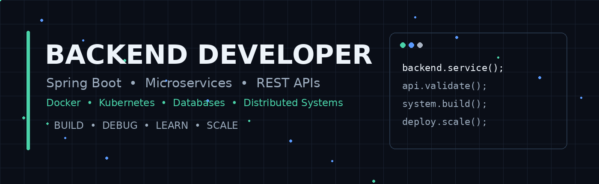

<div align="center">



# Hi 👋, I'm a Backend Developer

### `Backend Development` · `Spring Boot` · `Microservices` · `Docker` · `Kubernetes`

Building reliable backend applications, distributed systems, and production-ready APIs.

</div>

---

## 👨‍💻 About Me

- 💻 Backend developer focused on building **scalable and maintainable backend systems**
- 🏗️ Interested in **microservices, distributed systems, and system design**
- 🔐 Experience with **API security, authentication, encryption, validation, and secure communication**
- 🔄 Experience with **REST APIs, external service integrations, messaging, and asynchronous processing**
- 🗄️ Working with **relational and NoSQL databases**
- 🐳 Exploring **Docker, Kubernetes, and cloud-native application development**
- 📊 Interested in **production troubleshooting, performance optimization, JVM diagnostics, and observability**
- 📚 Continuously learning and improving backend engineering practices

---

## 🛠️ Technology

### Backend

<p>


</p>

### Database & Storage

<p>


</p>

### Messaging & Resilience

<p>


</p>

### DevOps & Tools

<p>


</p>

---

## 🚀 Featured Projects

### 🏦 Loan Application Platform

Backend services for loan processing and pricing-related workflows.

**Focus:**  
`REST APIs` · `Pricing Engine` · `Validation` · `External Service Integration` · `Database`

---

### 🔐 Host-to-Host Banking APIs

Backend services for inward and outward transaction workflows.

**Focus:**  
`API Security` · `Payload Encryption` · `Checksum` · `Duplicate Prevention` · `Document APIs`

---

### 📂 Document Management System

Document storage and retrieval architecture combining application data with unstructured document storage.

**Focus:**  
`JCR` · `Apache Oak` · `BlobStore` · `PostgreSQL` · `MongoDB` · `Docker`

---

## 🏗️ Architecture & What I Like Building

```text
                         ┌─────────────────────┐
                         │     REST Clients    │
                         └──────────┬──────────┘
                                    │
                                    ▼
                         ┌─────────────────────┐
                         │     API Gateway     │
                         └──────────┬──────────┘
                                    │
                   ┌────────────────┼────────────────┐
                   │                │                │
                   ▼                ▼                ▼
            ┌────────────┐   ┌────────────┐   ┌────────────┐
            │  Service A │   │  Service B │   │  Service C │
            └──────┬─────┘   └──────┬─────┘   └──────┬─────┘
                   │                │                │
                   ▼                ▼                ▼
            ┌────────────┐   ┌────────────┐   ┌────────────┐
            │  Database  │   │  Database  │   │   Queue    │
            └────────────┘   └────────────┘   └────────────┘
                   │                │                │
                   └────────────────┼────────────────┘
                                    ▼
                         ┌─────────────────────┐
                         │ External Services   │
                         └─────────────────────┘
```

### Engineering Interests

- 🔹 Service boundaries and independent deployment
- 🔹 API Gateway and service-to-service communication
- 🔹 Database design and transaction management
- 🔹 Resilience patterns and fault tolerance
- 🔹 Authentication, authorization, encryption, and data integrity
- 🔹 Asynchronous messaging and event-driven processing
- 🔹 Containerization and deployment
- 🔹 Production troubleshooting and JVM diagnostics

---

## 📚 Currently Learning

- ⚡ Advanced Spring Boot
- 🧩 Microservices architecture
- 🔄 Resilience4j — Retry & Rate Limiting
- 🐳 Docker & Kubernetes
- 🏗️ System Design
- 📦 JCR / Apache Oak / Document repositories
- 🔒 API security and encryption
- 📊 Production troubleshooting & JVM diagnostics
- ☁️ Cloud-native backend architecture

---

## 📊 GitHub Stats

<p align="center">
  
  
</p>

<p align="center">
  
</p>

---

## 🐍 Contribution Activity

<p align="center">
  <picture>
    <source media="(prefers-color-scheme: dark)"
            srcset="https://raw.githubusercontent.com/naveen-53/naveen-53/output/github-contribution-grid-snake-dark.svg">
    <source media="(prefers-color-scheme: light)"
            srcset="https://raw.githubusercontent.com/naveen-53/naveen-53/output/github-contribution-grid-snake.svg">
    
  </picture>
</p>

---

## 🤝 Connect With Me

<p>
<a href="https://www.linkedin.com/in/naveen5302">

</a>
<a href="mailto:naveennk5302@gmail.com">

</a>
</p>

---

<div align="center">

### `Code → Build → Debug → Learn → Scale`

⭐ Thanks for visiting my profile!

</div>
