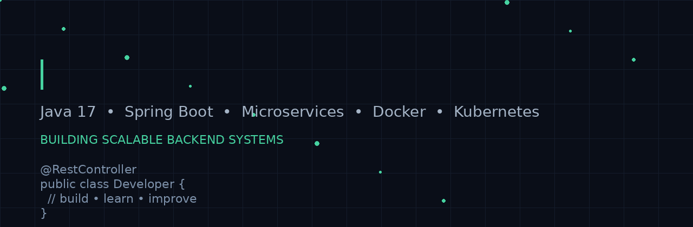

<div align="center">



# Hi 👋, I'm a Java Backend Developer

### `Java 17` · `Spring Boot` · `Microservices` · `Docker` · `Kubernetes`

Building backend applications, distributed systems, and production-ready APIs.

</div>

---

## 👨‍💻 About Me

- 💻 Backend developer focused on **Java & Spring Boot**
- 🏗️ Interested in **Microservices & distributed systems**
- 🔐 Working with **API security, authentication, encryption and validation**
- 🗄️ Experience with relational databases and document-oriented storage
- 🐳 Learning and working with **Docker & Kubernetes**
- 📚 Continuously improving Java, Spring Boot and system-design skills

---

## 🛠️ Tech Stack

### Backend
<p>


</p>

### Database & Messaging
<p>


</p>

### DevOps & Tools
<p>


</p>

---

## 🚀 Featured Projects

### 🏦 Loan Application
Spring Boot backend for loan processing and pricing-related workflows.

**Focus:** REST APIs · Pricing Engine · Validation · External Service Integration · Database

---

### 🔐 Host-to-Host Banking APIs
Backend services handling inward/outward transaction workflows.

**Focus:** API Security · Payload Encryption · Checksum · Duplicate Prevention · Document APIs

---

### 📂 Document Management System
Exploring document storage and retrieval using application data plus unstructured document storage.

**Focus:** JCR · Apache Oak · BlobStore · PostgreSQL · MongoDB · Docker

---

## 🏗️ What I Like Building

```text
                    ┌──────────────────┐
                    │   REST Clients   │
                    └────────┬─────────┘
                             │
                             ▼
                    ┌──────────────────┐
                    │   API Gateway    │
                    └────────┬─────────┘
                             │
              ┌──────────────┼──────────────┐
              ▼              ▼              ▼
        ┌──────────┐   ┌──────────┐   ┌──────────┐
        │ Service A│   │ Service B│   │ Service C│
        └────┬─────┘   └────┬─────┘   └────┬─────┘
             │              │              │
             ▼              ▼              ▼
        ┌──────────┐   ┌──────────┐   ┌──────────┐
        │ Database │   │ Database │   │  Queue   │
        └──────────┘   └──────────┘   └──────────┘
```

---

## 📚 Currently Learning

- ⚡ Advanced Spring Boot
- 🧩 Microservices architecture
- 🔄 Resilience4j — Retry & Rate Limiting
- 🐳 Docker & Kubernetes
- 🏗️ System Design
- 📦 JCR / Apache Oak / Document repositories
- 🔒 API security and encryption
- 📊 Production troubleshooting & JVM diagnostics

---

## 📊 GitHub Stats

<p align="center">
  
  
</p>

<p align="center">
  
</p>

---

## 🐍 Contribution Activity

<p align="center">
  
</p>

---

## 🤝 Connect With Me

<p>
<a href="https://www.linkedin.com/">

</a>
<a href="mailto:YOUR_EMAIL">

</a>
</p>

---

<div align="center">

### `Code → Build → Debug → Learn → Repeat`

⭐ Thanks for visiting my profile!

</div>
